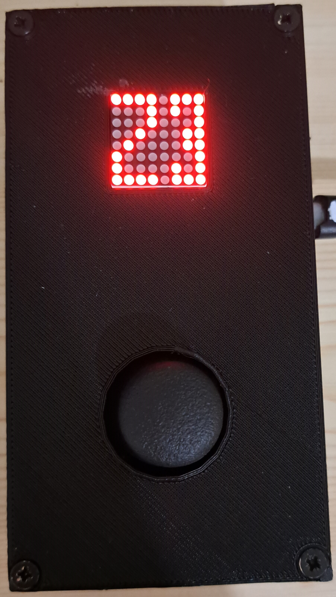

# RFID Card Cloning Device

- [Showcase](#showcase)
- [Prerequisites](#prerequisites)
- [What HW do I need?](#what-hw-do-i-need)
- [How does it work?](#how-does-it-work)
  - [After turning the device on](#after-turning-the-device-on)
  - [S mode](#s-mode)
  - [Z mode](#z-mode)
- [How to setup?](#how-to-setup)
- [Bitmap generator](#bitmap-generator)
- [Development notes](#development-notes)
- [Legal notice](#legal-notice)

# Showcase

[](./resources/showcase.mp4)

# Prerequisites

- Whenever the docs call something "a/the display", it means the 8x8 LED matrix
- Whenever the docs say "input", it means the Joystick, or selecting something with the Joystick
- Whenever the docs say "the menu", it means the 6 options (S1, S2, S3, Z1, Z2, Z3)
- Whenever the docs call something "a/the board", it means XIAO nRF52840
- The cloner supports 2 types of cards: 125KHz and 13.56MHz.
  - When referring to both, the docs say "type 1"
  - 125KHz is refferd to as "type 2"
  - 13.56MHz is refferd to as "type 3"
- All actions are tried **5 times** before failing. If you wish to change this behaviour, you can do so by changing `NUMBER_OF_EXECUTE_RETRIES` inside `./advanced/src/Menu.h`
- Code for the actual device is inside the `./advanced` folder and the resources for it are inside the `./resources` folder.
  - There is also the `./simple` folder. This was simply a test of mine (fully functional tho) before creating the final devices, to make sure that the 7941W is working as expected. If you want to just clone cards at home, wire it based on the `./simple/wiring.jpg` and upload the code using Platformio VSCode.

# What HW do I need?

1. Seeed Studio XIAO nRF52840
2. 7941W dual-frequency reader-writer
3. A Joystick
4. Adafruit Mini 8x8 LED Matrix w/I2C Backpack
5. A ON/OFF switch
6. 4 AAA battery case
7. Clear, writeable 125KHz (usually labeled EM4305/T5577) and 13.56MHz cards (for example Mifare 1k S50)

# How does it work?

<br/>
The heart component that allows this to work is the `7941W Dual-Frequency Card Reader/Writer`, which is controlled by the board using [the manufacturer's protocol over UART](https://www.icstation.com/dual-frequency-rfid-reader-writer-wireless-module-uart-1356mhz-125khz-icid-card-p-12444.html). <!-- I was unable to find docs, and the website I linked was used as a reference during the development --> This component does the whole "reading an ID" and "writing an ID" part of the device. <br />
However, as a user, you don't really care about that. (if you indeed care more about that tho, browse the source code, it's not that complicated `cat src/* | wc -l => 788`) <br />

## After turning the device on

If you're running in DEBUG mode (variable `DEBUG` inside `./advanced/src/debug.h` is set to `true` at the time of compilation), you will **skip** the initial animation where two images appear on the display for 1.5s (both):


After that, you will be put into the menu. This is the only way to control the device.
There are two main "modes". The S mode and Z mode. Both have 3 options. You can switch between the options and modes using the joystick (UP and DOWN movements) [if you're confused about the wiring, consult `./advanced/src/Joystick.cpp`].

## S mode

This mode is used for scanning cards. You can choose from one of 3 options (S1, S2, S3). <br/>


 <br/>
After you've selected the desired mode, place the card near the scanner (back of the device) and press down on the joystick. When the S mode succeeds, the card is remembered in RAM. When the S mode fails, nothing happens. The last remembered card is **always** the last successful scan result. After a successful scan, the result of the scan (image drawn to the display) stays there until a new input is registered. <br/>
As mentioned before, there are 3 options: <br/>

- S1: This mode works as S2 and S3 combined. It scans for both types of cards and then shows the results. Because of that, it has special success results. Other results are the same as for the S2 and S3 options (+ the number for which the result applies is shown after the result).
- S2: This mode scans only for the type 2 cards.
- S3: This mode scans only for the type 3 cards.

After each scan, there is a result shown. If the result **is not a Failure**, then the information (even if partial), gets stored in the device RAM. Even after a partial success (see below), you can still proceed to write this information onto your blank card (however it's probable that it won't work as expected). The results for **S2** and **S3** are as follows:

**Success:**
Everything went according to the plan: <br/>
 <br/>

**Undefined Response:**
There were errors while communicating with the cloning device. This can (for example) occur when there is not enough time for the card to be scanned: <br/>
 <br/>

**Invalid Checksum:**
The device sent back an ID, **however** the checksum of the message sent does not match the checksum calculated. This usually means that one or two of the bits of the ID received are not correct and there may have been some interference while receiving the data: <br/>
 <br/>

**Failure:**
The action failed. Nothing is stored into the RAM. This can occur when there is no supported card to be read. <br/>
 <br/>

**S1 Success (type 1):** <br />
 <br />
Both the type 2 and type 3 cards were found and scanned. This can happen when one card supports multiple frequencies, or when multiple cards were placed near the scanner.

**S1 Success (type 2):** <br />
 <br />

**S1 Success (type 3):** <br />
 <br />

## Z mode

This mode is used for writing scanned cards. You can choose from one of 3 options (Z1, Z2, Z3). <br/>


 <br/>
After you've read a card, you want to "clone it" onto your clear card. That's what these 3 modes are for. After you've selected one of the modes and pressed onto the joystick, there will be an action performed (based on the selection): <br/>

- Z1: This mode works as Z2 and Z3 combined. It tries to write onto both types of cards and then shows the results. Because of that, it has special success results. Other results are the same as for the Z2 and Z3 options.
- Z2: This mode tries to write onto the type 2 cards.
- Z3: This mode tries to write onto the type 3 cards.

Since the typical responses (Success, Undefined response, Invalid checksum, Failure,...) are the same for Z modes (and have the same implications, just replace "read" with "write" while reading them) as for the S modes, they are not included here. If you see them after using the Z mode, just consult the docs part above. <br/>
What is different, however, are the Z1 responses. After you try to write using Z1, there is always a type number flashed and the appropriate response for the card type (for example: "2 flashes with Failure and then 3 flashes with Success" -> This means that the device was unable to write onto type 2 card, however, it was able to write onto the type 3 card)
If you were to try to write before scanning any card, the following symbol will be shown, indicating that there is no card stored in the RAM. <br/>


# How to setup?

1. Somehow connect the wires according to the schematic
2. Write a new version of the firmware onto the device (using Platformio and VSCode)
3. 3D print the case using the exported files provided `./resources/case-export` or edit/export them on your own with FreeCAD `./resources/case.FCStd`
4. Put electronics into the case
   - for the insides, use +-1.5mm radius screws
   - the battery holder should be placed in the lower part of the back case such that you can replace them from the other side.
   - 7941W should be screwed onto the two columns inside the "back part" of the case.
   - board should be placed onto the "holder" right above the 7941W and pointing outwards by the USB-C port.
   - you can probably guess how to screw in the joystick and display based on the design of the "top part" of the case.
5. Screw the case together (use at most 3mm radius screws)
6. Enjoy your device :)
7. If you find a bug, or have a problem with anything SW/HW related, [open an issue](https://github.com/TDiblik/7941W-rfid-card-cloner/issues), or shoot me an email

# Bitmap generator

You might notice, in the root of the project, there is a Python script called `bitmap_generator.py`. You can use this to generate bitmaps to draw onto the display. All you have to do is start the program `python bitmap_generator.py`. The following window will pop up: <br/>
 <br/>
Here, you can draw something that you want to get displayed on the screen. After you're done, hit the "Generate" button. This will output "C code" that you can put into the project. The output will look like this:

```cpp
static const uint8_t PROGMEM NAME_BITMAP[]
{ 0b01100001,
  0b10010011,
  0b10000101,
  0b01000001,
  0b00100001,
  0b00010001,
  0b10010001,
  0b01100001 };
```

If you pass this as an argument into the `LEDMatrix.draw` or `LEDMatrix.blink` functions, it will get drawn. You can quickly test it out by changing the `main.cpp` to the following:

```cpp
#include <Arduino.h>
#include <Wire.h>
#include <SPI.h>

#include "debug.h"
#include "LEDMatrix.h"

static LEDMatrix led_matrix = LEDMatrix();

// REPLACE THIS WITH YOUR GENERATED BITMAP
static const uint8_t PROGMEM YOUR_GENERATED_BITMAP[]
{ 0b00000000,
  0b01001010,
  0b01001000,
  0b01111010,
  0b01001010,
  0b01001010,
  0b01001010,
  0b00000000 };

void setup() {
  Serial.begin(9600);
  led_matrix.setup();
  debug_println("LED Matrix - done");
}

void loop() {
  led_matrix.draw(YOUR_GENERATED_BITMAP);
  delay(500); // we don't want to spam it... Tbh, the `.draw` could be in the setup function and the loop could be empty
}
```

# Development notes

1. Before pushing a release version of the firmware, make sure to change the `DEBUG` variable inside `./advanced/src/debug.h` to `false` at the time of compilation.
2. As a convention, all bitmaps are stored inside the `./advanced/src/LEDMatrix.h` and named in UPPERCASE.

# Legal notice

The code/device/files (further addressed as just "device") provided are for educational purposes only and should not be used for any malicious or illegal activities. Any unauthorized use of this device is strictly prohibited and violators will be held liable for their actions. The device is intended to be used solely for the purpose of learning and understanding vulnerabilities and should not be executed on any systems without proper authorization and oversight. The author of this device takes no responsibility for any actions taken by any party using this device and is not liable for any damages or harm caused as a result of its use.
